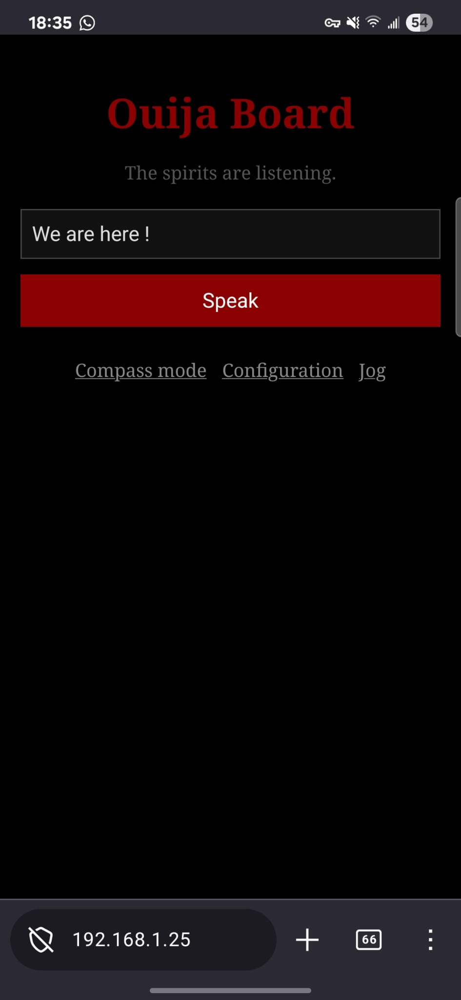
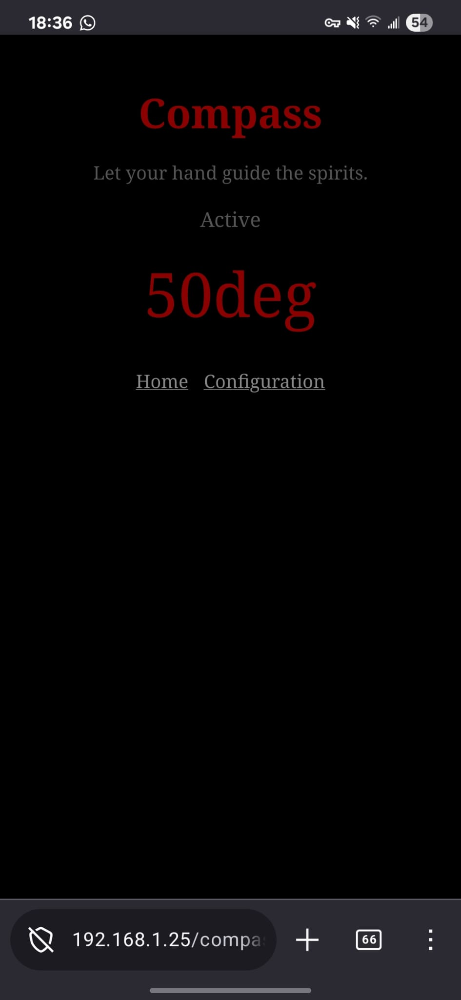
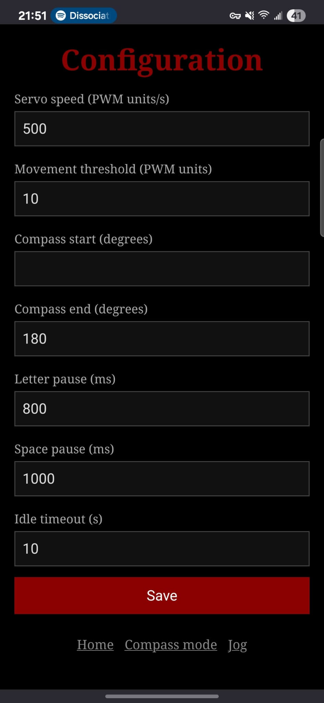
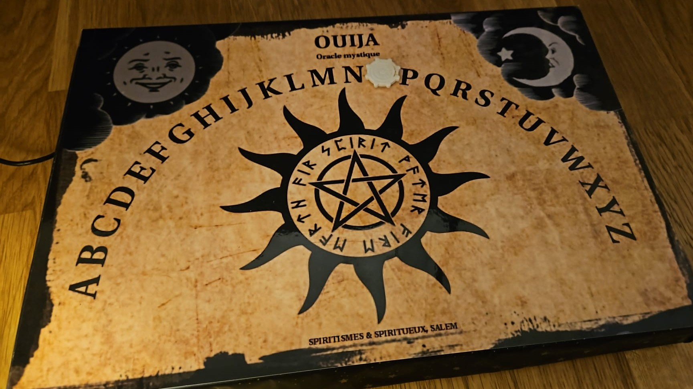
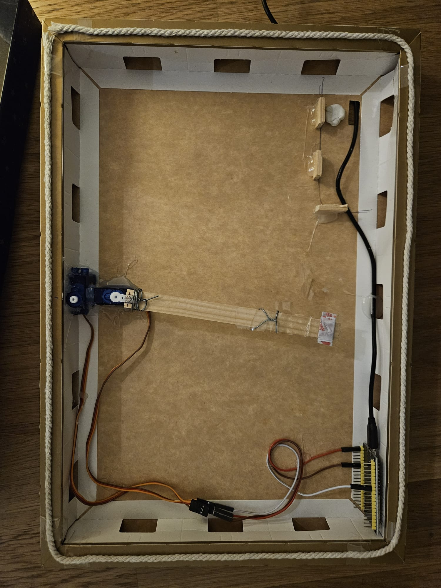
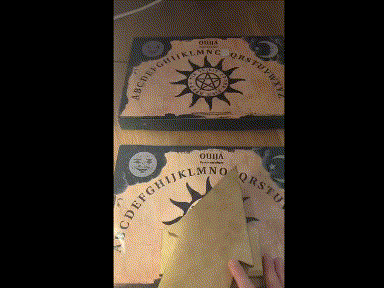

# Ouija Board IoT

Who needs a medium when you have a microcontroller? The planchette is a servo arm sweeping across letters on a ~120 degree arc. Cardboard, some magnets, and the spirits do the rest.

Flash an ESP32 with a web server code, allowing the spirits to communicate through two channels:

- **Compass mode:** open the compass webpage from your phone and the planchette mirrors your phone's orientation in real time

<p align="center">
    
</p>

- **Text mode:** send text to the ESP32 and the Ouija board spells it out, letter by letter. Integrate it in your smart home: "Hey Google, ask the spirits if they are here" and the board gravely spells YES

<p align="center">
    
</p>

## Screenshots gallery

  

## Make your board

<p align="center">
    
</p>

<details>
<summary>Suggestions</summary>

I will only provide suggestions, as creating your board is up to your imagination !

The instructions for `vocabulary.h` are compatible with words. The code should be adapted if you want to use more than one servomotor.

You may find my template useful (in French):
<p align="center">
    
</p>

<details>
<summary>Spoiler on how it looks inside !</summary>

<p align="center">

🙈 Yes it's really simple
</p>

</details>

</details>

I made this weekend project to prepare a Halloween theme escape game with friends. My use was to put the phone inside a wooden arrow in compass mode, and have one team send messages to the second team in another room. Although the second team did not know their own teammates were sending the message !

<p align="center">
    
</p>

## The spirits' language

Each word or letter the board can point to must be declared in `vocabulary.h`, paired with its servo PWM value. Incoming text is matched against the longest known token: so if `YES` is in the vocabulary, "Yes, you may!" points to `YES`, then spells `Y`, `O`, `U`, etc. The spirits will ignore in silence the tokens unknown to them, such as punctuation is our case.

Text matching is fully case-insensitive.

## Flashing the ESP32

1. Open `OuijaBoard/OuijaBoard.ino` in Arduino IDE 2
2. Install the ESP32 board support: go to **File > Preferences**, add the following URL to "Additional boards manager URLs":
   `https://raw.githubusercontent.com/espressif/arduino-esp32/gh-pages/package_esp32_index.json`
   Then open **Tools > Board > Boards Manager**, search for `esp32` and install it
3. Install the following libraries via **Tools > Manage Libraries**:
   - `AsyncTCP`
   - `ESPAsyncWebServer`
   - `ESP32Servo`
4. Select your board under **Tools > Board > esp32** and the correct port under **Tools > Port**
5. Click **Upload**

## How to summon the spirits

The ESP32 hosts a web server. If on awakening the WiFi credentials are not known or not working, then the Access Point mode is started. Connect to this network and visit `http://192.168.4.1` to configure your WiFi.

Once connected:

- The **home page** has a text input: type anything and the board starts spelling
- The **compass page** activates compass mode: the phone sends its orientation continuously and the planchette follows
- A POST or GET request to `/spell` lets external services trigger the board (see [Spell API](#spell-api) below)

## Spell API for smart home integration

Send text to the board from any HTTP client using the `/spell` endpoint. The `vocabulary.h` allows to escape spaces as `%20`.

**GET request** — pass the text as a query parameter:

```http
GET http://<ESP32-IP>/spell?text=Hello
```

```bash
curl "http://<ESP32-IP>/spell?text=Hello"
```

**POST request** — pass the text as a form field:

```http
POST http://<ESP32-IP>/spell
Content-Type: application/x-www-form-urlencoded

text=Hello
```

```bash
curl -X POST http://<ESP32-IP>/spell -d "text=Hello"
```

Both methods trigger the board to spell out the text and return `200 OK`. The GET response body is `OK` (plain text); the POST response is an HTML confirmation page.

## Configuration

The configuration page lets you tune the spirits' temperament.

| Parameter | Description |
| --- | --- |
| Servo speed | Rate of PWM change over time (PWM units/s) -- controls how fast the planchette sweeps |
| Movement threshold | Minimum PWM difference before the spirits deign to react -- prevents jitter from noisy compass readings |
| Compass start | Compass heading (degrees) that maps to the first letter of the arc |
| Compass end | Compass heading (degrees) that maps to the last letter of the arc |
| Letter pause | How long the planchette holds on a word or letter |
| Space pause | How long the planchette pauses on a space |
